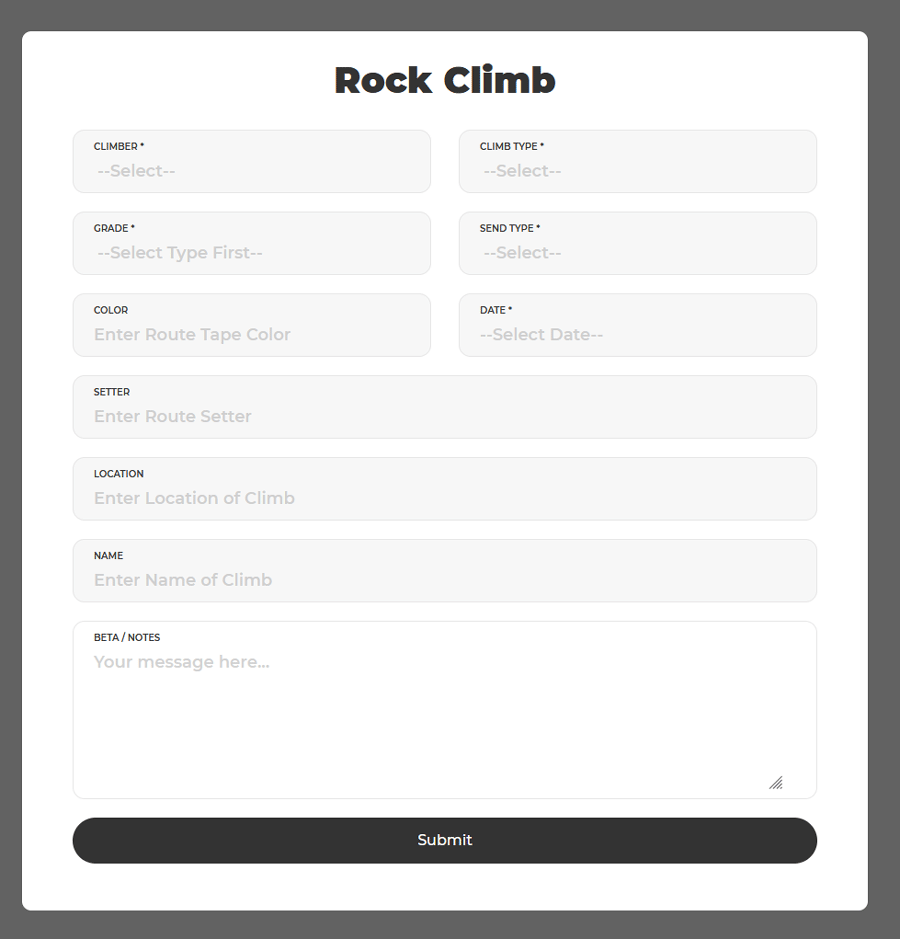
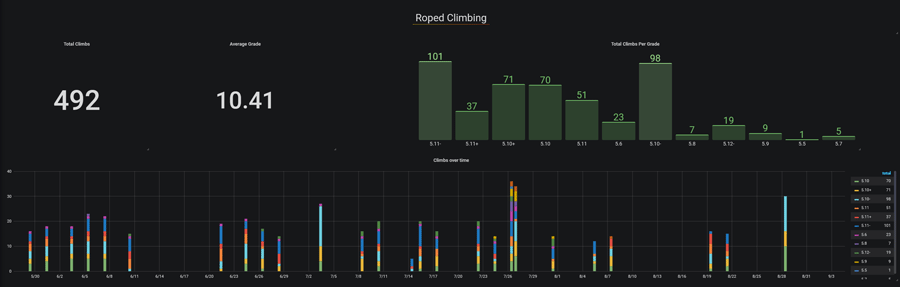

# Climbing Statistics              
## Track your climbing progress!
- Input data in a web form
- Stores climbs in a mysql database
- Presents data using a Grafana dashboard

## Screenshots
### Web Form


### Dashboard


## Requirements
In order to run this you will need
- Web server (Apache, Nginx, etc)
- Mysql database
- PHP
- Grafana

## Installation
This can be built using a basic LAMP stack with the addition of Grafana for graphing. The instructions are for CentOS7 / Apache / Mariadb / PHP 5.4, but any other distribution and web server software can be used. PHP is a very small part of this and is just used to insert submited data into the database. Newer PHP should work but has not been tested.

### Basic LAMP stack setup for CentOS7
_You can skip this section if you already have this installed_ 
#### Httpd (Apache)
- Install software
```shell
yum -y install httpd
``` 
- Start httpd and ensure it runs on boot
```shell
systemctl enable --now httpd
```
Update firewall
```shell
firewall-cmd --permanent --add-service http; firewall-cmd --reload
```
#### Mariadb (Mysql)
- Install software
```shell
yum -y install mariadb-server
```
- Start Mariadb and ensure it runs on boot
```bash
systemctl enable --now mariadb
```
- Secure Mariadb
```shell
mysql_secure_installation
```
#### PHP
- Install software
```shell
yum -y install php php-mysql
```
- Restart httpd
```shell
systemctl restart httpd
```

### Install Grafana
- [Grafans's Install guide](https://grafana.com/docs/grafana/latest/installation/)

### Get software
```shell
git clone https://github.com/bananatrunking/ClimbingStats.git
```

### Setup web form for data entry
Move all files in web folder to server's web root
```shell
cd ClimbingStats
cp -R web/* /var/www/html/
chown -R apache.apache /var/www/html/
```
Edit Javascript [web/script/submit.js]("web/script/submit.js") to update climber names that will be inputing stats
 - Curently set to ('Bart', 'bart'); and ('Lisa', 'lisa');

### Database
- Log into Mariadb and create a database called climbing
```shell
mysql> CREATE DATABASE climbing
```
- Create a new user 
```shell
mysql> CREATE USER 'climbstat'@'localhost' IDENTIFIED BY 'SecurePassword';
```
- Grant new user permissions on database  
```shell
mysql> GRANT ALL PRIVILEGES ON climbing.* TO 'climbstat'@'localhost';
```
- Edit database schema [db/db_schema.sql]("db/db_schema.sql") to update climber names that will be inputing stats
  - Curently set to ('Bart', 'Lisa')
- Load schema [db/db_schema.sql]("db/db_schema.sql") into Mariadb
```shell
mysql -u climbstat -p < db/db_schema.sql
```
- Update PHP file [web/script/insert.php]("web/script/insert.php") with database details

### Grafana Dashboard
- Setup the new database we just created in Grafana as a datasource
- Load [graph/graphana_dashboard.json](graph/graphana_dashboard.json) into grafana

## Notes
- Climbs input into the web form are stored on the date selected using the date picker however time is statically set to 6am in web/script/insert.php. For my use, I have no need for exact timing. In the future, this could be added as an additional form field.
- Right now I have the database setup to only allow pre-entered climbers. This is constrained by the enum data type I set for that field. I also hard code this in the Javascript used to populate dropdowns on the web form. For my use, this works great and is all I need. This is obviously not great for tracking lots of climbers. In the future, the database schema can be extended to have a users table which can link to the climbs table using some unique user ID. The Javascript and PHP could at that point be extended to query the database for climbers, populating the dropdown a bit more dynamically. 
- The graphs in the Grafana dashboard do not have the climber as a contraint on the data query. If more than 1 climber is being tracked, the graph queries will need to be updated with that additional selector. 
- This was built for internal use and is in no way safe for public facing form access.
